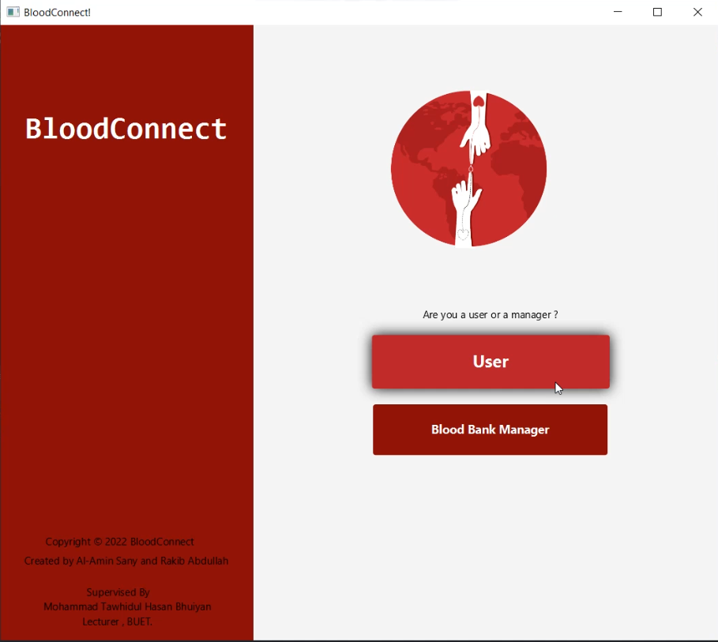
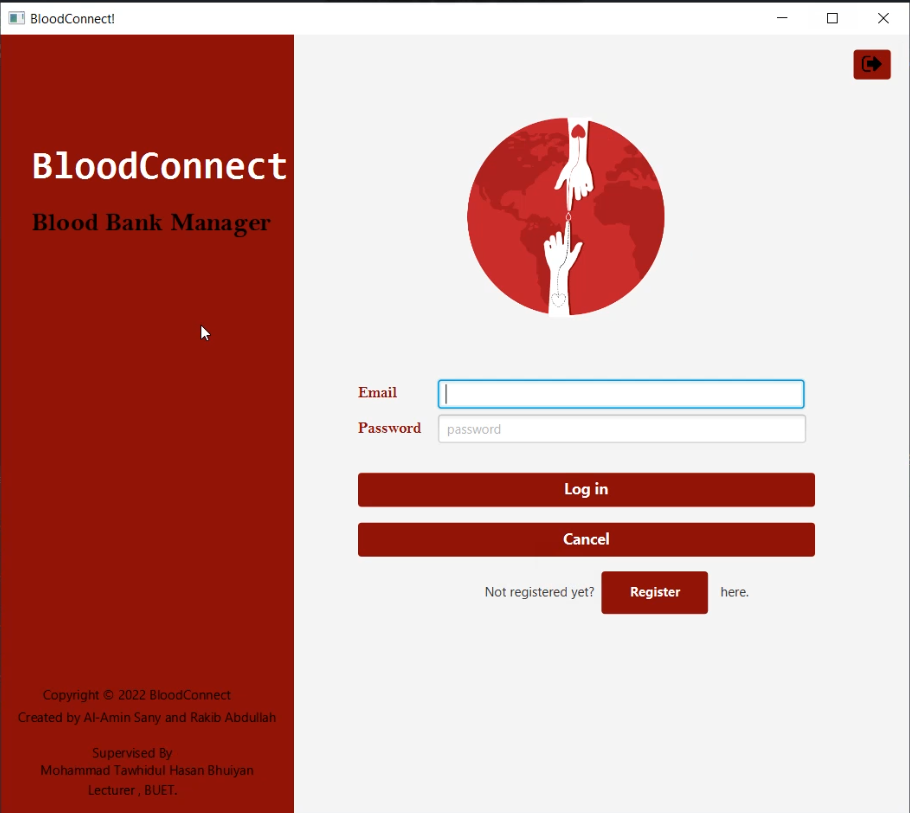

## Login Pages

  
  
  

## Home Pages

  
  

## User Pages
### New Blood Request

### Blood Post Details

### Edit Blood Post

### Blood Donation Post

### Blood Donation Post Warning

### Notification

### Blood Bank List

### Blood Bank Details

### Blood Request To Blood Bank

## Blood Bank Manager Pages
### Blood Request List

### Accept Blood Request

### Approved Blood Request

### Blood Req Status

### Update Blood Stock

### Event List

  
  

### Event Creation

## User side event pages

